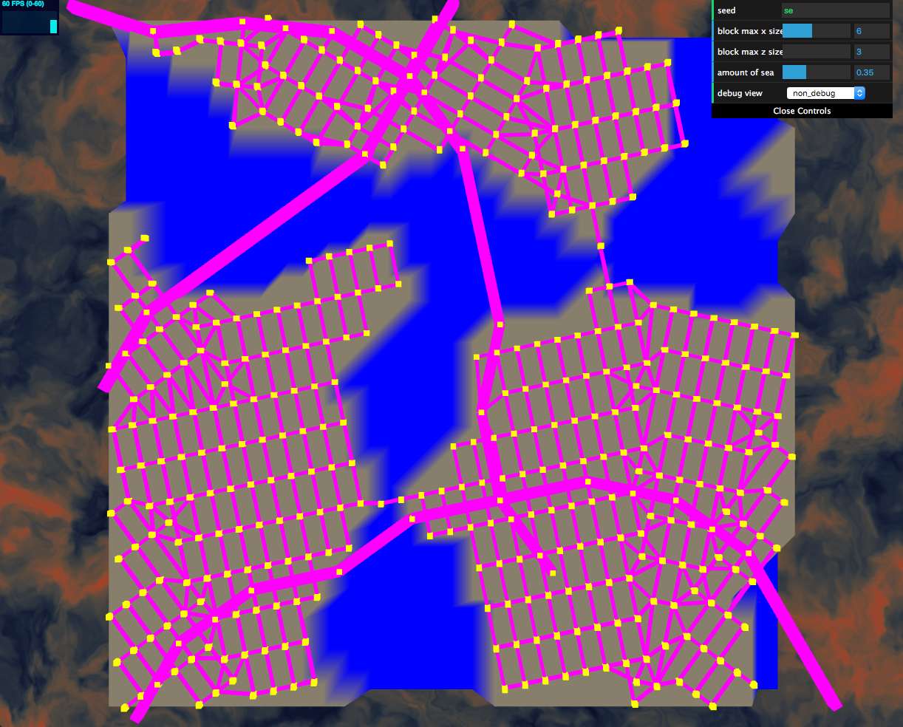
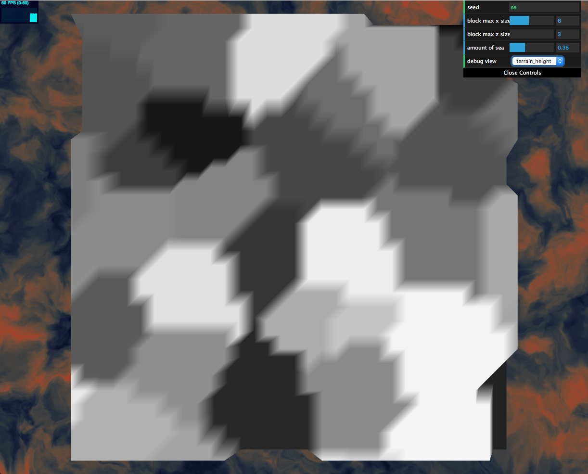
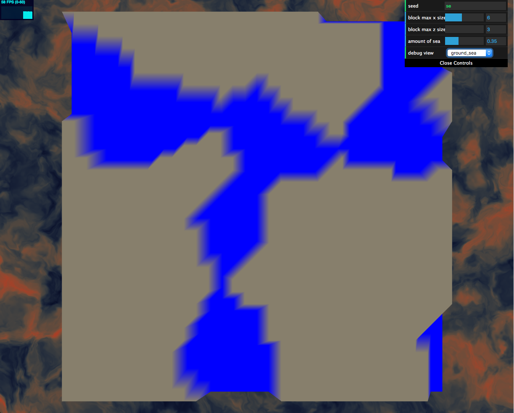
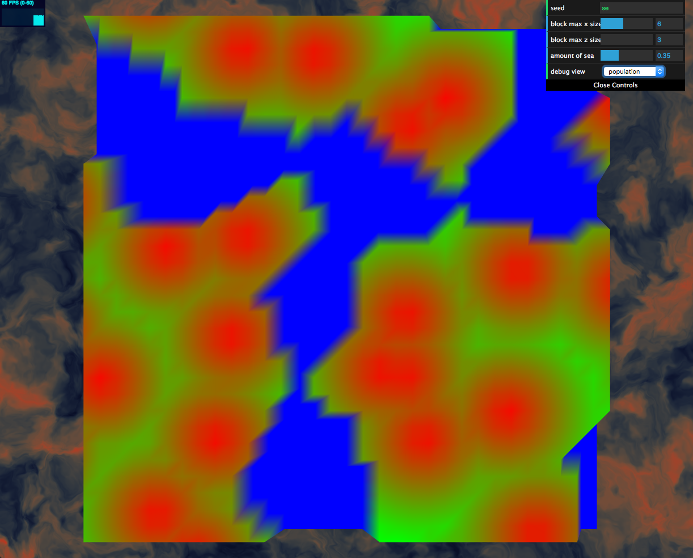

# Procedural Road and City Generation

This project tries to generate a reasonable road and city rendering in pure procedural way. The base terrain and population are based on cellular noise (Worley noise). The roads and buildings are generated based on the population.

**University of Pennsylvania, CIS 566 Procedrual Graphics, Procedural Road and City Generation**

* Zichuan Yu
  * [LinkedIn](https://www.linkedin.com/in/zichuan-yu/), [Behance](https://www.behance.net/zainyu717ebcc)
* Tested on: Macbook Pro macOS High Sierra Version 10.13.6 (17G66), i7-4870HQ @ 2.50GHz 16GB, AMD Radeon R9 M370X 2048 MB, Intel Iris Pro 1536 MB

## Results

### [Demo](https://zichuanyun.github.io/road-and-city-generation/)

|Final Result|Terrain Height|
|-|-|
|||

|Ground and Sea|Population Density|
|-|-|
|||

## Randomness

All the random number / vector generation is ultimately based on this javescrpt random number generation:

```
private getHashInt(str: string): number {
  var hash = 0, i, chr;
  if (str.length === 0) return hash;
  for (i = 0; i < str.length; i++) {
    chr   = str.charCodeAt(i);
    hash  = ((hash << 5) - hash) + chr;
    hash |= 0; // Convert to 32bit integer
  }
  return hash;
};
```

Credits to https://stackoverflow.com/questions/7616461/generate-a-hash-from-string-in-javascript.

The hash uses a string seed specified at ui.

```
this.seed = hash.sha1(this.si.globalSeed);
```

## Terrain and Population


### Terrain

Terrain is generated using Worley noise. Each Worley cell has a pseudo random height:


Cells with height below certain threshold specified by user become sea area:


### Population

Population density is also generated using Worley noise. Area near the Worley Kernel has denser population:


## Road Generation

Road generation is fully based on [Procedural Modeling of Cities](https://dl.acm.org/citation.cfm?id=383292), section 3.

An extended L-system (as described in section 3.1) is implemented with the following features:

- List-bode-based. During production, node->nodes is executed (instead of symbol->symbols).
- Selfaware. The nodes contain attributes to be checked against existing roads on map, and decide what kind of node to append.
- No "trutle". Similar with the Selfawareness feature, the roads are being created on the map while the abstruct list is being expanded. Each node contains the full attributes to create a road segment on map.

## Credits

* [dat.gui](https://github.com/dataarts/dat.gui)
* [Procedural Modeling of Cities](https://dl.acm.org/citation.cfm?id=383292)
* [Real-time Procedural Generation of ‘Pseudo Infinite’ Cities](https://dl.acm.org/citation.cfm?doid=604471.604490)